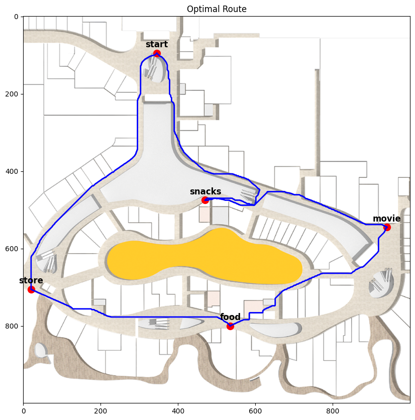

# ME5413_HW3

# **A* Path Planning and Traveling Shopper Problem (TSP)**

## 📌 Project Overview  
This project utilizes the **A* (A-star) algorithm** for **path planning** on a **1000x1000** grid map and solves the **Traveling Shopper Problem (TSP)** to determine the optimal route for visiting **`start → snacks → food → movie → store → start`**.

- **Path Planning**: Finds the shortest path while avoiding obstacles.  
- **TSP Problem**: Computes the optimal visiting order of key locations to minimize the total distance.  
- **Visualization**: Plots the optimal path and marks key locations on the map.  

---

## 🚀 Environment Setup  
Ensure Python version **>=3.8** and install the required dependencies using:  

```bash
pip install -r requirements.txt
```

---

## 📁 Project Structure
```plaintext
├── main.ipynb          # Main code (Jupyter Notebook)
├── data/               # Stores map and location information
│   ├── vivocity.png
│   ├── vivocity_freespace.png
│   ├── vivocity_freespace_raw.png
├── results/            # Output results
│   ├── map_location.png
│   ├── route_BruteForceMethod.png
│   ├── route_GreedyMethod.png
├── README.md           # Project documentation
├── requirements.txt    # Dependencies
├── LICENSE
```

---

## 🛠️ How to Run  

### 1️⃣ Open Jupyter Notebook
```bash
jupyter notebook
```
Then, open `main.ipynb` in your browser and run all the cells.

---

## 📊 Visualization  
After running `main.ipynb`, you can find the optimal route visualization in `results/route_BruteForceMethod.png`:  

  

---

## 📌 Key Techniques  

1. **A* Algorithm**
   - Uses **8-directional search** (including diagonal movement).
   - Supports different heuristic functions such as **Euclidean, Manhattan, and Diagonal distances**.
   - Cost calculation: **0.2m (straight) / 0.282m (diagonal)**.

2. **Traveling Shopper Problem (TSP)**
   - **Brute Force Search**: Computes all permutations to find the optimal path.
   - **Dynamic Programming + Memoization** (to optimize computational complexity).

3. **Visualization**
   - Uses Matplotlib to plot the map and paths.
   - Highlights key locations (`start, snacks, store, movie, food`).

---

## 📜 License  
This project is released under the **MIT License**, allowing free usage and modification.

---

## 🤝 Contributions  
If you have better algorithms or optimization suggestions, feel free to submit a PR!
 version provides a **clear**, **well-structured**, and **professional** README file in English, making it suitable for a GitHub repository. 🚀